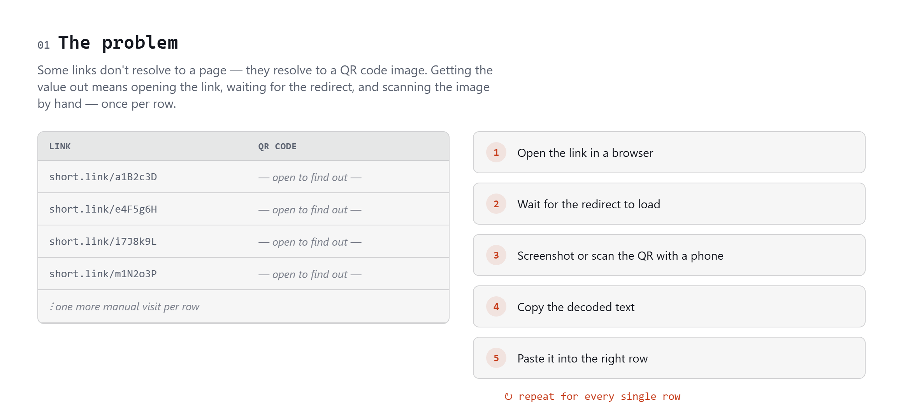
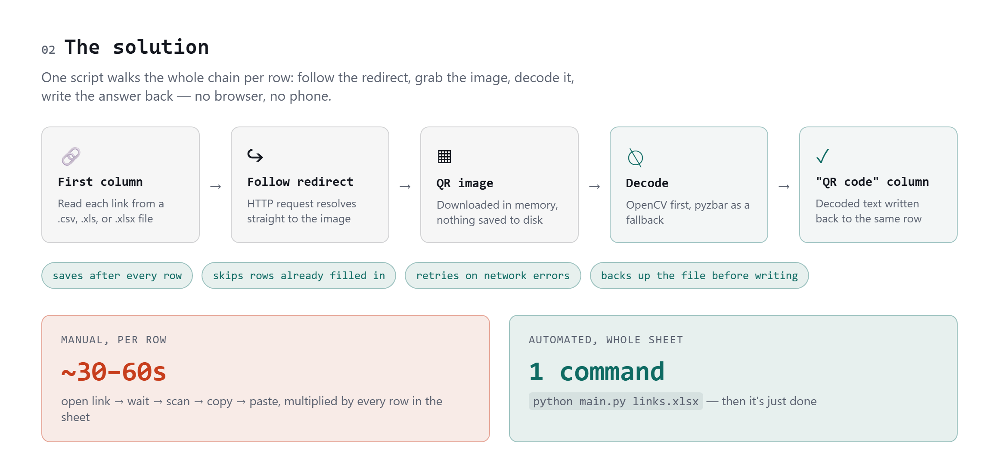

<picture>
  <source media="(prefers-color-scheme: dark)" srcset="assets/banner-dark.png">
  <source media="(prefers-color-scheme: light)" srcset="assets/banner-light.png">
  
</picture>

Decode QR codes hidden behind redirect links, in bulk, straight from a spreadsheet.

<picture>
  <source media="(prefers-color-scheme: dark)" srcset="assets/problem-dark.png">
  <source media="(prefers-color-scheme: light)" srcset="assets/problem-light.png">
  
</picture>

## What it does

`main.py` reads a list of links from a column of a file (the first column, by default), and for every row:

1. Follows the link's redirect straight to the image (no browser needed)
2. Decodes the QR code in memory
3. Writes the decoded text into a `QR code` column, in the same row

Works with `.csv`, `.xls`, and `.xlsx` files.

<picture>
  <source media="(prefers-color-scheme: dark)" srcset="assets/solution-dark.png">
  <source media="(prefers-color-scheme: light)" srcset="assets/solution-light.png">
  
</picture>

## For the ops team (no install needed)

Download `QRLinkDecoder.exe` from the [GitHub Releases page](../../releases) (or from the latest [Actions build](../../actions/workflows/build-windows.yml) artifact) and double-click it. No Python, no command line.

1. **Select File...** — pick your `.csv`, `.xls`, or `.xlsx` file.
2. Pick the column that holds the QR links from the dropdown (it's pre-guessed for you).
3. Choose to update the file in place (a backup is saved automatically) or save to a new file.
4. **Start** — watch the log as it runs. **Cancel** stops it early without losing what's already done.
5. When it finishes you'll get a summary of how many decoded vs. failed, and can jump straight to the output folder.

It's safe to re-run on the same file — rows that already succeeded are skipped.

## Install

```bash
python -m venv venv
venv\Scripts\activate        # macOS/Linux: source venv/bin/activate
pip install -r requirements.txt
```

## Usage

### GUI

```bash
python gui.py
```

Opens the same file-picker/log/summary flow described above, for local runs from source instead of the packaged `.exe`.

### Command line

```bash
python main.py links.xlsx
```

```
python main.py <input> [output] [-c COLUMN]
```

- `input` — a `.csv`, `.xls`, or `.xlsx` file with links in a column.
- `output` (optional) — where to write results. If omitted, the input file is updated in place (a `.bak` backup is written first). You can also pass a path with a different extension to convert formats, e.g. `python main.py links.csv links.xlsx`.
- `-c`/`--column` (optional) — which column holds the links, given as a column name or a 1-based column number. If omitted, the first column is used, e.g. `python main.py links.xlsx -c 3` or `python main.py links.xlsx -c "Redirect URL"`.

```bash
python main.py input.csv                          # same as before, uses column 1
python main.py input.csv output.csv -c 3           # use column 3
python main.py input.csv -c "Redirect URL"         # use column by name
```

### Trying it out

[example_links.xlsx](example_links.xlsx) shows the expected layout — a `Link` column followed by an empty `QR code` column — but its links are just placeholders. To test the script end-to-end with real redirect links:

1. Upload an image somewhere they'll get a public URL (a bucket, a CDN, even a GitHub repo's raw file URL).
2. In [short.io](https://short.io) (or any link shortener), create one short link per image, pointing at that image's public URL.
3. Paste those short links into the `Link` column of a copy of `example_links.xlsx`, replacing the placeholders.
4. Run `python main.py your_copy.xlsx` — the `QR code` column should fill in with `QR-DEMO-0001` through `QR-DEMO-0004`, confirming the whole redirect → image → decode chain works before you point it at real data.

The script prints progress as it goes and saves after every row, so a network hiccup partway through never loses what's already been decoded. Rows that already have a value in the `QR code` column are skipped, so it's always safe to re-run — it'll only pick up rows that are still missing or previously failed.

## Building the .exe

There are two ways to get `QRLinkDecoder.exe` — pick whichever fits the moment.

### Option A: Build locally on Windows (fastest, for testing changes)

On a Windows machine, with this repo checked out:

```
git pull
build_windows.bat
```

The script creates a `venv` if there isn't one already, installs dependencies, runs PyInstaller, and launches the resulting `dist\QRLinkDecoder.exe` for you. Re-run it any time after pulling new changes.

### Option B: Build with GitHub Actions (for distributing to the ops team)

This doesn't require a Windows machine at all — GitHub builds it for you on a Windows runner.

**Trigger a build manually (no release, just grab the file):**

1. Push your changes: `git push`
2. Go to the repo's **Actions** tab → **Build Windows executable** (left sidebar) → **Run workflow** button → **Run workflow**.
3. Wait for the run to finish (~1-2 minutes) — click into it once it's green.
4. Under **Artifacts** at the bottom of the run page, download **QRLinkDecoder-windows** (a zip containing the `.exe`).

**Or, cut a proper release (gives the ops team a stable download link):**

```bash
git tag v1.0.0
git push origin v1.0.0
```

Pushing a tag matching `v*.*.*` triggers the same build automatically and attaches `QRLinkDecoder.exe` directly to a new entry on the repo's **Releases** page — that's the link to share with the ops team, and the one referenced above.

## Notes

- **`.xls` output isn't supported** — it's a retired format. If you run the script on an `.xls` file without specifying an output path, results are saved to a sibling `.xlsx` file instead.
- Failed rows get `ERROR: <reason>` written into the `QR code` column instead of being left blank, so you can see exactly which links to check.
- QR decoding tries [OpenCV](https://opencv.org/) first, then falls back to [pyzbar](https://github.com/NaturalHistoryMuseum/pyzbar) if that fails.

## Built with

Python · [requests](https://requests.readthedocs.io/) · [pandas](https://pandas.pydata.org/) · [openpyxl](https://openpyxl.readthedocs.io/) · [OpenCV](https://opencv.org/) · [pyzbar](https://github.com/NaturalHistoryMuseum/pyzbar)
