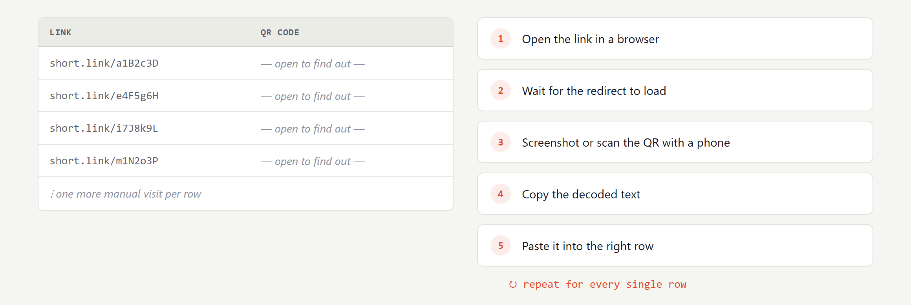
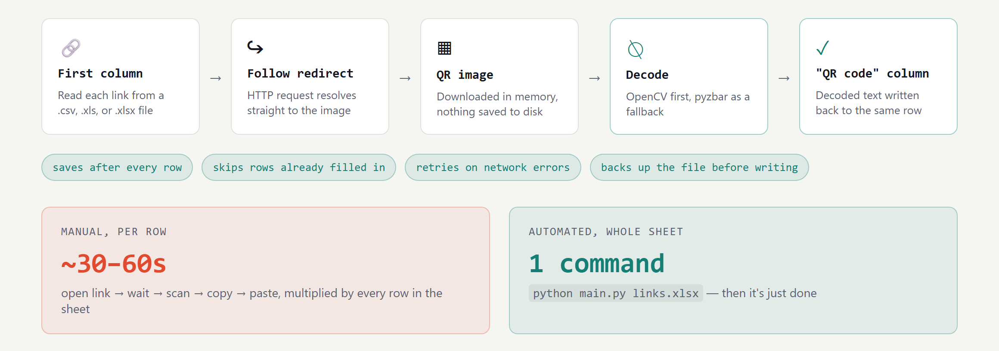

# qr-link-decoder
Turns redirect links that resolve to QR code images into the plain text hiding inside them, automatically, across a whole spreadsheet.
Decode QR codes hidden behind redirect links, in bulk, straight from a spreadsheet.

## The problem

Some links don't lead to a page — they redirect straight to a QR code image. To get the value out, someone has to open the link, wait for the redirect, scan the image (usually with a phone), and copy the result back into a spreadsheet. One row at a time.



## What it does

`main.py` reads a list of links from the first column of a file, and for every row:

1. Follows the link's redirect straight to the image (no browser needed)
2. Decodes the QR code in memory
3. Writes the decoded text into a `QR code` column, in the same row

Works with `.csv`, `.xls`, and `.xlsx` files.



## The solution

One script walks the whole chain per row: follow the redirect, grab the image, decode it, write the decode text back - bo browser, no phone.

## Install

```bash
python -m venv venv
venv\Scripts\activate        # macOS/Linux: source venv/bin/activate
pip install -r requirements.txt
```

## Usage

```bash
python main.py links.xlsx
```

```
python main.py <input> [output]
```

- `input` — a `.csv`, `.xls`, or `.xlsx` file with links in the first column.
- `output` (optional) — where to write results. If omitted, the input file is updated in place (a `.bak` backup is written first). You can also pass a path with a different extension to convert formats, e.g. `python main.py links.csv links.xlsx`.

### Trying it out

[example_links.xlsx](example_links.xlsx) shows the expected layout — a `Link` column followed by an empty `QR code` column — but its links are just placeholders. To test the script end-to-end with real redirect links:

1. Upload the images in [sample_qr_codes/](sample_qr_codes/) somewhere they'll get a public URL (a bucket, a CDN, even a GitHub repo's raw file URL).
2. In [short.io](https://short.io) (or any link shortener), create one short link per image, pointing at that image's public URL.
3. Paste those short links into the `Link` column of a copy of `example_links.xlsx`, replacing the placeholders.
4. Run `python main.py your_copy.xlsx` — the `QR code` column should fill in with `QR-DEMO-0001` through `QR-DEMO-0004`, confirming the whole redirect → image → decode chain works before you point it at real data.

The script prints progress as it goes and saves after every row, so a network hiccup partway through never loses what's already been decoded. Rows that already have a value in the `QR code` column are skipped, so it's always safe to re-run — it'll only pick up rows that are still missing or previously failed.

## Notes

- **`.xls` output isn't supported** — it's a retired format. If you run the script on an `.xls` file without specifying an output path, results are saved to a sibling `.xlsx` file instead.
- Failed rows get `ERROR: <reason>` written into the `QR code` column instead of being left blank, so you can see exactly which links to check.
- QR decoding tries [OpenCV](https://opencv.org/) first, then falls back to [pyzbar](https://github.com/NaturalHistoryMuseum/pyzbar) if that fails.

## Built with

Python · [requests](https://requests.readthedocs.io/) · [pandas](https://pandas.pydata.org/) · [openpyxl](https://openpyxl.readthedocs.io/) · [OpenCV](https://opencv.org/) · [pyzbar](https://github.com/NaturalHistoryMuseum/pyzbar)
